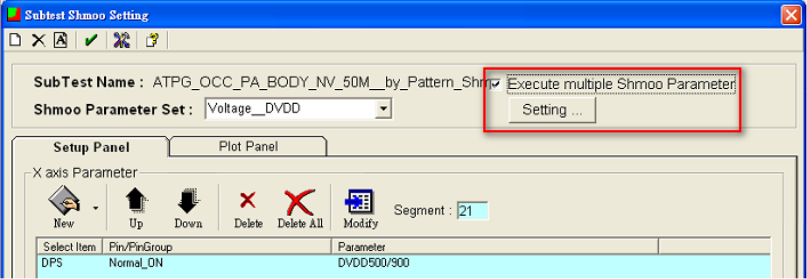
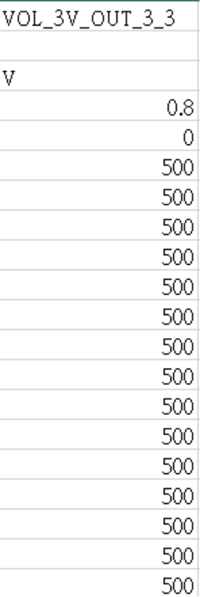
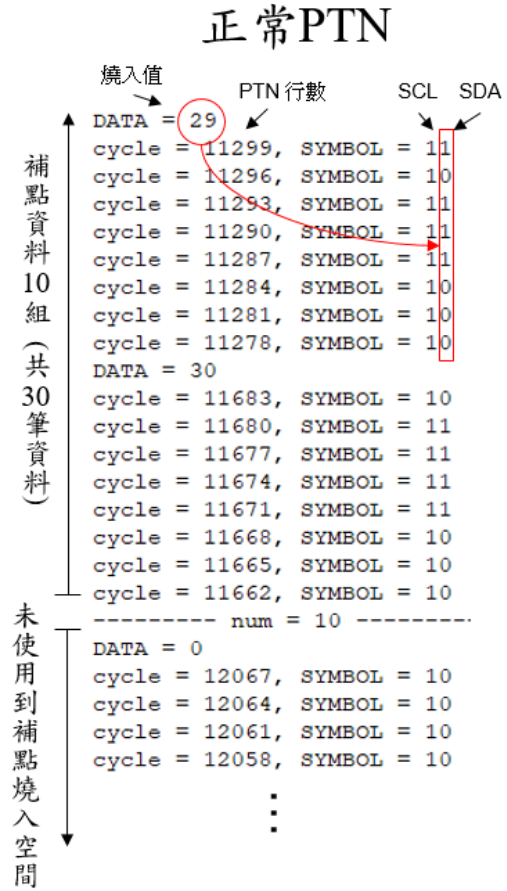

|   ISSUE’S GENERAL INFORMATION   |  Describe  |
|  ---------  |  ---------  |
|  Issue Date  |  2023/03/13  |
|  部門/Owner  |  7220/陳昱全  |
|  Customer  |  MTK  |
|  CP/FT  |  CP  |
|  Device Issue  |  MT7923 Run Multi Shmoo  |
|  平台  |  E320BD-CH  |
|  異常判定  |  軟體  |
|  Keywords  |  shmoo, by pattern  |
|  Application  |  WIFI6  |

|   ANALYSIS AND SOLUTION   |  Describe  |
|  ---------  |  ---------  |
|  1. Current State  |  1. 客戶現階段的shmoo工程需求如下： a. By pattern收集shmoo，例如ATPG_Phase_A的bodypattern有60支，就必須要收集60組shmoo結果。 b.每支pattern各別都有多個shmoo參數設定需要收集，mail中的單支pattern就有12個shmoo參數。 c. 若每個條件都要建立一項ShmooSubtest Item，換算後光是ATPG_Phase_A測試項就要拆成60 * 12 =720個shmoo測試項，但ATPG不會只有Phase_A，且還有許多不同ATPGType、其他測試項也有相同需求。2. 客戶提供的Framework內容如下：3.shmoo工程中的pattetn不見得會是同一版，shmoo參數也會有調整的可能性，若一旦改版就算有Framework要再重建的花費時間也是滿大的，因為編輯出來的項目還是必須要再後製微調，且仍有出錯的可能性。4. shmoo測試項過多，尋找單一項目時不容易也不直覺，Flow編輯上也相對麻煩許多。  |
|  2. Defect/Risk Summary  |  1. Shmoo Subtest Item數量過多，少則幾百個測試項，多則幾千個測試項，項目過冗導致指定項目尋找不易，光是編輯TestFlow就是一個大工程，非常容易出錯。 2. 無論是透過UI或是.sub檔新增/變更Shmoo Subtest Item，所需要花費的時間是相當大量的。  |
|  3. Processing  |  與軟體部提出新的SHMOO測試項測試架構  |
|  4. Solution  |  Ver_402之後新版UI新增By Pattern run multiple Shmoo Parameter功能，操作方式介紹如下：1.在UI的Test Programming介面點擊滑鼠右鍵，選擇Subtest Set Shmoo。2. 建立Shmoo ParameterSet3.完成該測試項的所有Shmoo Parameter Set需求 4. 勾選Execute multiple ShmooParameter 5.點選紅框中的Setting6.上圖中的設定步驟如下所述a. 在有勾選By Pattern Shmoo的情況下，UI將會針對指定Function icon中各個EntryPattern獨立執行所要求的Shmoo Parameter。反之，則與平常掃Shmoo的狀況相同，一次對所有Pattern執行所要求的ShmooParameter。 b. 在有勾選By Pattern Shmoo的情況下，需指定欲要針對哪個Function icon執行By Pattern RunShmoo的動作。 c. By Pattern Run Shmoo前可選擇設定每次必然需要被執行的Header Pattern / Enter ModePattern。 d. 選定需要被執行的多個Shmoo Parameter。 7.下圖為設定完成後的畫面  |
|  5. conclusion  |   1. 上圖為 ByPattern Run Multiple Shmoo Parameter的結果，說明如下：Pattern的數量：13Shmoo Parameter的數量：52. By Pattern Run Multiple Shmoo Parameter的結果，組合數量 = 13 * 5 = 65組 3. 當Pattern * Shmoo Parameter的組合數量越大時，By Pattern Run Multiple ShmooParameter功能可節省大量的編輯時間，並且降低編輯過程可能出現的失誤。  |

|   ISSUE’S GENERAL INFORMATION   |  Describe  |
|  ---------  |  ---------  |
|  Issue Date  |  2024/01/16  |
|  部門 / Owner  |  7210/楊勝雄  |
|  Customer  |  PHISON  |
|  CP / FT  |  FT  |
|  Device Issue  |  PS5017 BGA169 Flash RDT TYP測試項量產All Site Fail ISSUE  |
|  平台  |  E320BD-CH  |
|  異常判定  |  程式  |
|  Keywords  |  MOS Relay, All Site Fail  |
|  Application  |  SATA Flash Controller  |

|   ANALYSIS AND SOLUTION   |  Describe  |
|  ---------  |  ---------  |
|  1. Current State  |  前言此產品在特定機台量產出現SBin63 FT1_FT_RDT不良率過高問題，且Fail當下幾乎為All Site Fail 問題描述PS5017 BGA169 Release機台為CH003/CH008，使用V15程式在CH008有偶發RDT All Site FailIssue，V15程式在CH003則無此問題  V15程式量產BGA169貨批TO10079AA1 正測Yield:85.21%(22153/25999) Major Fail: SBin63 FT1_FT_RDT6.58%(1712/25999) SBin63Recovery Rate98.13%(1680/1712)  |
|  2. PotentialRoot Cause  Analysis  |  機台/配件確認 CH008工程驗證皆為All Site Pass，初步判斷機台/配件正常，無法還原RDTAll Site Fail狀況，請設備PM機台，量產仍然會出現RDT All SiteFail(非真因) UI確認量產UI版本為316_32，提出先Fail的Site會把其他Site URC 一起off的疑慮，請軟體部幫忙實驗，TD也同步使用公版DUTBoard焊接COTO2211於實驗室BDC機台進行實驗 硬體配置 使用兩顆COTO2211 Relay切換DPS to I/O，DPS送電給I/O，以Compare Z做為Pass/Fail依據 程式設定 仿Flash RDT TYP測試項建立深度接近的Pattern(3.9sec)分段跑， DPS與URCChannel皆為獨立，將Site A compare Fail再去執行2 Site FlowRun TD實驗結論使用URC沒有勾選Multi-site時，最後才同時動作 以跑Flow方式驗證，當Site A提早Fail時，Site A URC off，此時SiteB繼續跑Pattern，直到Site B跑完Pass，Site B URC off，故沒有site A提早Fail後，把SiteB的URC一起off問題(非真因)  URC有勾選Multi-site時，最後才同時動作 以跑Flow方式驗證，確認提早Fail的SiteA會關電，但URC不會先off，等到Site B跑完後，才一起將2 Site URC一起off(非真因) 軟體部/硬體部工程師實驗結論 URCon/off在316_32 UI硬體與軟體動作一致 實驗2 Site Flow Run， Fail Site將URC off時，不會同時把其他的SiteURC off掉，URC動作正常 程式確認 LB早期規劃一組3.3V驅動4 Site MOS Relay(5 pcs/1Site)，程式電流檔位500mA(Clamp=±100mA)，若Contact不好導致Loading變大，100mA電流不足以讓4 Site MOSRelay正常做動(真因)  |
|  3. Root Cause Analysis  |  真因確認 上機驗證RDT Fail IC皆為Pass(誤宰)，RDT All Site Fail真因分析應為Index ArmContact偏差問題影響負載電流，此時3.3V /Scale 500mA(Clamp=±100mA)給All Site MOSRelay使用，電流會不夠導致切換異常，故將Clamp放寬 於CH008僅有一次還原All Site RDT連續Fail問題，將4 Site MOS Relay共用的Power3.3V/Scale 500mA電流Clamp放大至±500mA，3 Site Loop10次Pass確認有改善  |
|  4. Root CauseSummary  |   驗證困難點為無法有效還原Flash RDT TYP All SiteFail環境，僅在其中一次實驗中成功還原問題，並且修改程式Fail to Pass，V16程式已加入MOS Relay Power 3.3V/ Scale500mA(Clamp=±500mA)  Flash RDT TYP測試項因為Contact不佳導致負載電流變大，而原本MOS Relay Power3.3V的電流Clamp=±100mA不夠使用，故放寬至Clamp=±500mA讓電流可以供MOS Relay正常運作  Flash RDTTYP測試項量產狀況 CH008 V15(TO10079AA1)正測不良率6.58%(1712/25999)V16(TO3004BAA3)正測不良率1.5%(439/29213) CH003V15(TNA01SZAA2)正測不良率0.02%(7/41629) V16(TO30070AA1)正測不良率0.02%(6/37512)  |
|  5. Solution  |   當產品有一推多組MOS Relay時，需要將供應電流開大，以防止當Contact不佳時，負載電流變化導致MOS Relay切換異常  |

|   ISSUE’S GENERAL INFORMATION   |  Describe  |
|  ---------  |  ---------  |
|  Issue Date  |  2024/07/10  |
|  部門 / Owner  |  7290 / 林宥廷  |
|  Customer  |  Silergy  |
|  CP / FT  |  CP  |
|  Device Issue  |  SY13080 Search量測輸出不穩定Issue  |
|  平台  |  E320BD-C  |
|  異常判定  |  配件  |
|  Keywords  |  Search、雜訊  |
|  Application  |  Light Sensor  |

|   ANALYSIS AND SOLUTION   |  Describe  |
|  ---------  |  ---------  |
|  1. Current State  |  問題描述Silergy SY13080VOL測試項是使用Search功能逐步調整Level，在轉態點進行量測，如圖[一]為測試環境示意圖與在此測試項發生量測結果不穩問題。圖[一]測試環境示意圖與VOL Loop Run結果  |
|  2. PotentialRoot Cause  Analysis  |  1. DPS/PE Card異常，進行K機確認機台輸出穩定。  2. 程式參數設定錯誤，使用示波器確認Tester輸出波型。  3. 光源機輸出與亮度是否有異常，導致IC輸出異常。  4. IC輸出不穩定，使用示波器確認IC輸出波型。  |
|  3. Root Cause Analysis  |  程式設定如圖[二]所示程式依客戶要求使用Seach From 1V to 0V，Step=-10mV條件下(找Pass轉Fail的轉態點)進行測試，經檢查機台排除非硬體造成異常後，點測即有機率出現Fail，Log如圖[三]。圖[二]Seach From 1V TO 0V ,STEP=-10mV圖[三]Pass轉Fail量測Log示波器量測在程式設定依客戶要求且非機台異常狀態下，進行示波器量測IC輸出波型驗證，如圖[四]發現IC輸出時會有100mV~200mV振幅突波，導致進行量測時有機率將突波高峰點判斷為轉態點，進而導致量測數值不穩。圖[四]IC輸出波型量測不穩原因SY13080此產品運作方式如圖[五]所示，光源機需持續閃爍(亮/暗)，IC才會進入工作模式，若是光源常亮則會進入待機模式。圖[五]產品運作圖由客戶提供的光源機電路圖如圖[六]所示，光源機Power持續供給5V電壓，再由Tr191送入訊號給SN7404反向器。透過反向器將訊號送入光源機接地端，使其在光源機內造成壓差並驅動光源機開燈與關燈。經電表量測與SN7404Datasheet(圖[七])交叉比對，確認由反向器輸出High時的輸出電壓為2.4V，因此在光源機需要關燈的狀態下，光源機內部還有約2.6V的壓差，而驅動光源僅需1.8V即可驅動，因此會造成需要關燈的狀態下造成光源機微亮，使IC響應會產生雜訊與突波，導致Search到突波的電壓。圖[六]光源機電路圖圖[七] SN7404Datasheet  |
|  4. Root CauseSummary  |  與客戶討論後調整Search範圍，並將SN7404從P/C上移除，修改後的電路如圖[八]所示，直接由Tr136使用Pattern輸入訊號給光源機(訊號1為全暗；訊號0為全亮)，並將提供5V電壓的P31改由P15提供。圖[八]修改後光源機電路圖如圖[九]所示，經上述修改電路後已有改善量測不穩的問題，也不會因光源微亮使IC誤做動造成雜訊與突波。圖[九] 修改後VOL Loop Run&量測Log結果如圖[十]所示，使用示波器進行輸入波型的驗證，確認IC輸出也較為穩定，沒有因為IC誤做動而產生的雜訊與突波。圖[十]移除SN7404後的IC輸出波型  |
|  5. Solution  |  1. 因客戶提供SN7404的IOH過低只能將輸出電壓推動到2.4V，無法符合測試條件，未來遇到類似情況需先檢查外部IC的Datasheet，確認是否能夠Support測試條件，以避免相同狀況發生。  2. 移除SN7404並由Pattern提供訊號，因少了反向器的轉換，對於光源的亮暗設定較不直觀，需特別注意Pattern內使光源閃爍的訊號設定。  3. 未來若有相同需求的測試，可以使用Loading較高的MOS FET(場效應電晶體)取代SN7404，避免輸出電流過低造成達不到測試條件的需求。  |

|   ISSUE’S GENERAL INFORMATION   |  Describe  |
|  ---------  |  ---------  |
|  Issue Date  |  2024/03/06  |
|  部門 / Owner  |  7290 / 林宥廷  |
|  Customer  |  SITRONIX  |
|  CP / FT  |  CP  |
|  Device Issue  |  SITRONIX-AA003 影像補點縮時  |
|  平台  |  I6000B  |
|  異常判定  |  機台硬體、方法  |
|  Keywords  |  OTP、Trim影像補點、TTR  |
|  Application  |  Light Sensor  |

|   ANALYSIS AND SOLUTION   |  Describe  |
|  ---------  |  ---------  |
|  1. Current State  |  SITRONIX-AA003影像補點(BPC) Trim  1. P/C設計共16 Site，此產品每個Site至多寫入64組補點資料，每組由3筆8bit資料組成。2. 未使用到空間不可燒入且Trim 0亦不可重複燒入，故有誤燒風險須避免。3. 每個Site補點資料數量不相同，將導致每個SiteTrim Pattern執行長度不同。4. 在目前E320機台硬體架構下僅能使用Series run 對各Site分別執行不同長度Pattern，這將花費較多時間，並不符合客戶成本。  |
|  2. PotentialRoot Cause  Analysis  |  1. Normal Trim Pattern(Series Run)：1.將燒入值十進制轉變為8bit二進制值。2. 於Pattern SDA相對應行數動態改Pattern，帶入二進制值。3. 使All site執行Pattern 0到最後一行。(附件一)4. MAX 64*3*8bit資料。  2. 未使用到空間不燒入(Series Run)：  1. 未使用到空間不可燒入，每個site Pattern結束行數不同，需使用CBASE Series run 執行Pattern。(附件二)3. 將未使用到空間SCL設為0 (Parallel Run)：  1. 動態改Pattern將未使用空間的SCL改為0，執行到此段時，因SCL沒有持續送訊號，則使IC停止燒入(減少誤燒機會)。  2. 使All site 執行Pattern 0到最後一行。(附件三)  |
|  3. Root Cause Analysis  |  Environment & Product analysis:  1. 使用SCL為0方式進行Subtest設定。(附件四)  2. CBASE程式內容撰寫方式，使用動態改Pattern將未使用空間的SCL改0，以減少測試時間與誤燒機會。(附件五)  |
|  4. Root CauseSummary  |  1. 依不同Trim條件模擬，在三種測試方式的測試時間整理如下表與下圖所示。  |
|  5. Solution  |  1. 由圖表可得知將未使用空間的SCL設為0方式，可有效降低BPC Trim測試項約62%~74%的測試時間，並且也可避免誤燒風險，故此Case採用將未使用空間的SCL設為0並執行全部Pattern方式進行縮時。  2. 未來可持續優化縮時，將此次與前一次動態改Pattern的內容進行比對，只需修改相同的Ram但資料不同的位置，即可再更進一步的縮時。  |
|  6. Attachment  |  附件一附件二EX : 如下圖Site 0執行至11662行，Site1執行至2446行。 附件三附件四附件五  |

