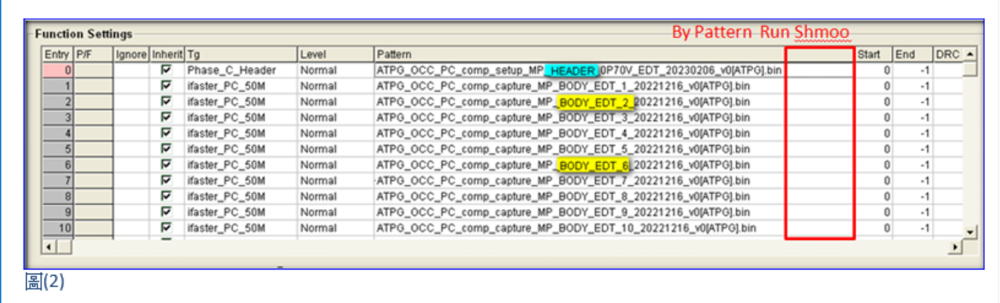

# ISSUE’S GENERAL INFORMATION
Issue Date |部門/Owner |Customer |CP/FT |Device Issue |平台 |異常判定 |Keywords |Application |
| ---------- |---------- |---------- |---------- |---------- |---------- |---------- |---------- |---------- |
| 2023/03/13 |7220/陳昱全 |MTK |CP |MT7923 Run Multi Shmoo |E320BD-CH |軟體 |shmoo, by pattern |WIFI6 |
# ANALYSIS AND SOLUTION
## 1. Current State
1.  客戶現階段的shmoo工程需求如下：
   a. By pattern收集shmoo，例如ATPG_Phase_A的bodypattern有60支，就必須要收集60組shmoo結果。
   b.每支pattern各別都有多個shmoo參數設定需要收集，mail中的單支pattern就有12個shmoo參數。
   c. 若每個條件都要建立一項ShmooSubtest Item，換算後光是ATPG_Phase_A測試項就要拆成60 * 12 =720個shmoo測試項，但ATPG不會只有Phase_A，且還有許多不同ATPGType、其他測試項也有相同需求。

   

   

2.  客戶提供的Framework內容如下：

   

3. shmoo工程中的pattetn不見得會是同一版，shmoo參數也會有調整的可能性，若一旦改版就算有Framework要再重建的花費時間也是滿大的，因為編輯出來的項目還是必須要再後製微調，且仍有出錯的可能性。
4.  shmoo測試項過多，尋找單一項目時不容易也不直覺，Flow編輯上也相對麻煩許多。
## 2. Defect/Risk Summary
1.  Shmoo Subtest Item數量過多，少則幾百個測試項，多則幾千個測試項，項目過冗導致指定項目尋找不易，光是編輯TestFlow就是一個大工程，非常容易出錯。
2.  無論是透過UI或是.sub檔新增/變更Shmoo Subtest Item，所需要花費的時間是相當大量的。
## 3. Processing
* 與軟體部提出新的SHMOO測試項測試架構

## 4. Solution
* Ver_402之後新版UI新增By Pattern run multiple Shmoo Parameter功能，操作方式介紹如下：
   1. 在UI的Test Programming介面點擊滑鼠右鍵，選擇Subtest Set Shmoo。

   

   2.  建立Shmoo ParameterSet

   

   3. 完成該測試項的所有Shmoo Parameter Set需求

   

   4.  勾選Execute multiple ShmooParameter

   

   5. 點選紅框中的Setting

   

   

6. 上圖中的設定步驟如下所述：
      a. 在有勾選By Pattern Shmoo的情況下，UI將會針對指定Function icon中各個EntryPattern獨立執行所要求的Shmoo Parameter，反之，則與平常掃Shmoo的狀況相同，一次對所有Pattern執行所要求的ShmooParameter。
      b. 在有勾選By Pattern Shmoo的情況下，需指定欲要針對哪個Function icon執行By Pattern RunShmoo的動作。
      c. By Pattern Run Shmoo前可選擇設定每次必然需要被執行的Header Pattern / Enter ModePattern。
      d. 選定需要被執行的多個Shmoo Parameter。
      7. 下圖為設定完成後的畫面

      

## 5. conclusion

1.  上圖為 ByPattern Run Multiple Shmoo Parameter的結果，說明如左\-->Pattern的數量為13、ShmooParameter的數量為5。
2.  By Pattern Run Multiple Shmoo Parameter的結果，組合數量 = 13 * 5 =65組。
3.  當 Pattern * Shmoo Parameter的組合數量越大時，By Pattern Run Multiple ShmooParameter功能可節省大量的編輯時間，並且降低編輯過程可能出現的失誤。
